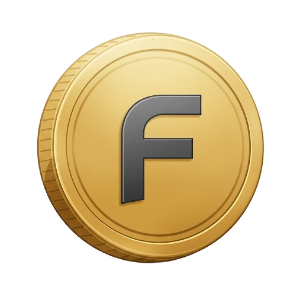

# Fukuoka Nomad Connect

A digital ecosystem platform for nomads in Fukuoka, Japan, built on Next.js and Solana blockchain.



## 🌟 Overview

Fukuoka Nomad Connect is a web3 platform that bridges digital nomads and locals in Fukuoka through three core features:

- **Local Value Network**: A local cryptocurrency system for the Fukuoka nomad community
- **Skills Hub**: Exchange platform for sharing knowledge and services
- **Community Fund**: Collective funding for community initiatives and projects

The platform is built on Solana for fast, low-cost transactions.

## 🛠️ Tech Stack

- **Frontend**: Next.js 15.3, React 19, TypeScript
- **Styling**: Tailwind CSS 4 with custom design system
- **Blockchain**: Solana with Wallet Adapter integration
- **Smart Contracts**: Anchor framework
- **Authentication**: NFT-based Nomad Welcome Pass

## 🚀 Getting Started

### Prerequisites

- Node.js 20.x or later
- NPM 10.x or later
- Solana CLI tools (for blockchain interaction)

### Installation

1. Clone this repository:
   ```bash
   git clone https://github.com/your-org/fukuoka-nomad-connect.git
   cd fukuoka-nomad-connect
   ```

2. Install dependencies:
   ```bash
   npm install
   ```

3. Run the development server:
   ```bash
   npm run dev
   ```

4. Open [http://localhost:3000](http://localhost:3000) with your browser

## 🎨 Design System

The project uses a consistent design system with:

- **Primary Color**: Teal Blue (#00A9A5)
- **Solana Brand Colors**: Purple (#9945FF) and Green (#14F195)
- **Secondary Accent**: Amber (#FFC107)
- **Typography**: Geist Sans font family
- **Components**: Standardized buttons, cards, and layout elements

## 📋 Features

### Local Value Network
A community currency system where nomads and locals can exchange services, goods, and support the local economy.

### Skills Hub
A platform for talent exchange, mentorship, and knowledge sharing between digital nomads and local residents.

### Community Fund
A collective treasury for funding local initiatives, events, and projects that benefit the community.

### Nomad Welcome Pass NFT
NFT-based access pass that serves as identity verification and platform access token.

## 🚢 Deployment

1. Build the production-ready application:
   ```bash
   npm run build
   ```

2. Run the deployment script:
   ```bash
   chmod +x deploy.sh
   ./deploy.sh
   ```

3. Configure your preferred deployment option in `deploy.sh`:
   - Vercel (recommended for Next.js)
   - Netlify
   - AWS Amplify
   - Standard Node.js server

## 🧪 Testing

```bash
# Run unit and integration tests
npm test

# Run end-to-end tests
npm run test:e2e
```

## 📚 Documentation

For more detailed information about using and contributing to this project:

- [User Guide](docs/user-guide.md)
- [Developer Documentation](docs/developer.md)
- [API Reference](docs/api-reference.md)
- [Solana Integration](docs/solana-integration.md)

## 🤝 Contributing

Contributions are welcome! Please check out our [Contributing Guide](CONTRIBUTING.md) for guidelines.

## 📄 License

This project is licensed under the MIT License - see the [LICENSE](LICENSE) file for details.

## 🙏 Acknowledgements

- Fukuoka City for supporting digital nomad initiatives
- Solana Foundation for blockchain infrastructure
- All contributors and community members
